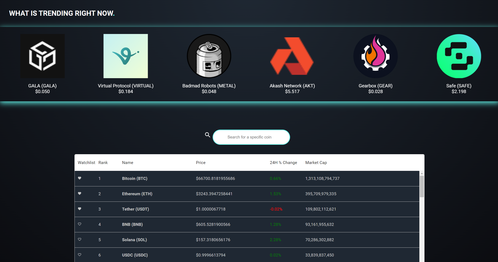
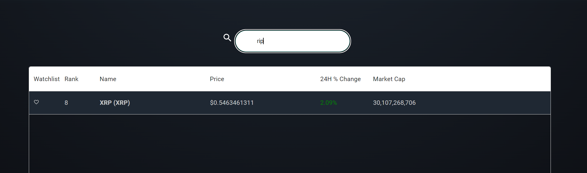
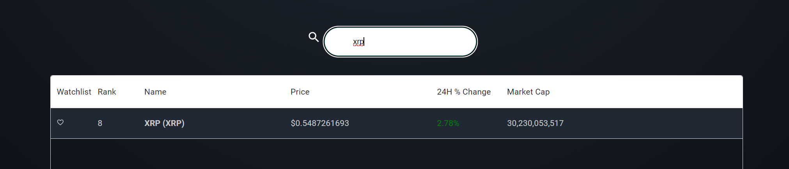
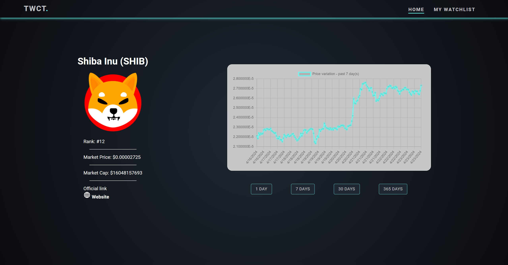
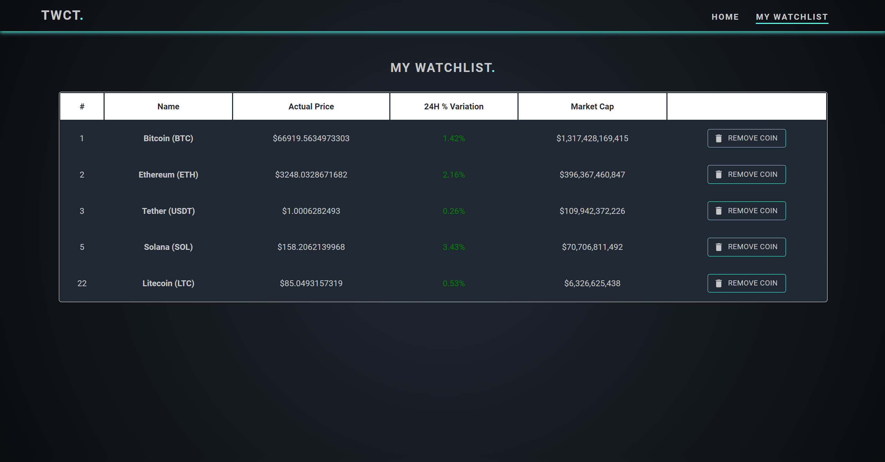

# Tech Wave Crypto Tracker

Tech Wave Crypto Tracker (TWCT) is a modern cryptocurrency tracking application that provides users with real-time data on trending coins, detailed coin information and personalized watchlists. The app aims to be the best free crypto tracker in the market (wink wink).
It was built as part of a Frontend Code Challenge.

## Table of Contents

1. [Features](#features)
2. [Tech Stack](#tech-stack)
3. [Installation](#installation)
4. [Usage](#usage)
5. [License](#license)
6. [Contact](#contact)

## Features

- **Real-Time Crypto Data**: Displays real-time information for various cryptocurrencies, including price, market cap, and 24-hour price change.
- **Trending Coins Carousel**: Provides a list of 15 currently trending coins.
- **Detailed Coin Information**: Offers information for each coin, including historical price charts and links to official resources.
- **Watchlist Management**: Users can create a personalized watchlist to track their favorite coins.

## Tech Stack

- **Frontend**: React, TypeScript
- **Routing**: React Router
- **Package Manager**: npm
- **UI Components**: Material UI
- **Carousel**: alice-carousel
- **Charts**: react-chartjs
- **API**: Custom API calls using Axios to CoinGecko (cryptocurrency data source)

## Installation

Before starting, ensure you have [Node.js](https://nodejs.org/) and npm installed. Then follow these steps:

1. **Clone the repository**:
   git clone https://github.com/your-username/tech-wave-crypto-tracker.git

2. **Navigate to the project directory**:
   cd tech-wave-crypto-tracker

3. **Install dependencies**:
   npm install

4. **Start development server**:
   npm run dev

## Usage

Here's what you can do with Tech Wave Crypto Tracker:

• _Homepage_: Overview of the app with a call-to-action to view more details.

‣ Trending coins: Explore the currently trending cryptocurrencies (no clickable option).
‣ Search bar: Search for a specific coin using the name or symbol of the coin.
‣ Coins table: Table with detailed information about various coins, search and sort functionality and watchlist management (refreshes every minute).

• _Coin Page_: If you click on any coin from Coins Table, it will redirect to the specific coin page where you can view detailed information, including charts and link to external resources (coin official website).

• _Watchlist_: Access your personalized watchlist to track your favorite coins.

## License

This project is licensed under the [MIT License](nhecs).

## Contact

If you have any questions or feedback, feel free to reach out:

Email: [brunorcunha3000@gmail.com](mailto:brunorcunha3000@gmail.com)
GitHub: [[Your GitHub Profile](https://github.com/brcunha3000)]

Thank you for using Tech Wave Crypto Tracker!
